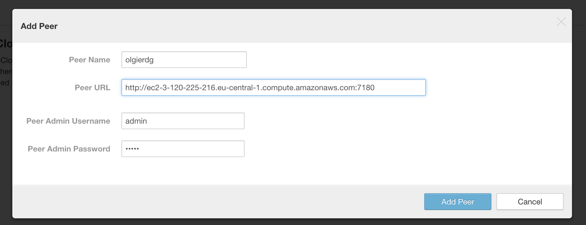
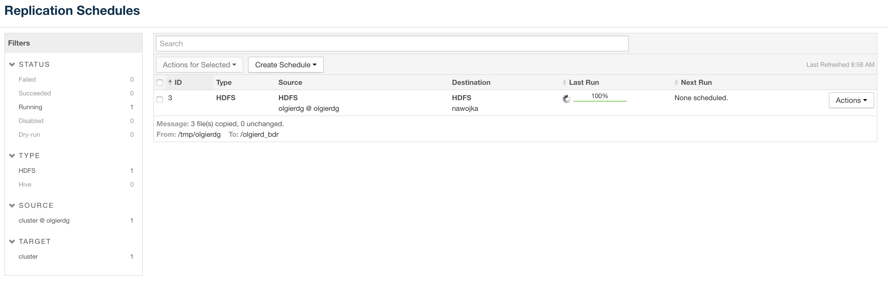

Copy from olgierdg cluster using DistCP:
```
[centos@ip-172-31-44-213 ~]$ sudo -u hdfs hadoop distcp hdfs://ec2-18-196-102-174.eu-central-1.compute.amazonaws.com:8022/tmp/olgierdg  /olgierdg
18/10/16 08:40:45 INFO tools.DistCp: Input Options: DistCpOptions{atomicCommit=false, syncFolder=false, deleteMissing=false, ignoreFailures=false, overwrite=false, append=false, useDiff=false, useRdiff=false, fromSnapshot=null, toSnapshot=null, skipCRC=false, blocking=true, numListstatusThreads=0, maxMaps=20, mapBandwidth=100, sslConfigurationFile='null', copyStrategy='uniformsize', preserveStatus=[], preserveRawXattrs=false, atomicWorkPath=null, logPath=null, sourceFileListing=null, sourcePaths=[hdfs://ec2-18-196-102-174.eu-central-1.compute.amazonaws.com:8022/tmp/olgierdg], targetPath=/olgierdg, targetPathExists=true, filtersFile='null'}
18/10/16 08:40:45 INFO client.RMProxy: Connecting to ResourceManager at ip-172-31-33-143.eu-central-1.compute.internal/172.31.33.143:8032
18/10/16 08:40:46 INFO tools.SimpleCopyListing: Paths (files+dirs) cnt = 4; dirCnt = 1
18/10/16 08:40:46 INFO tools.SimpleCopyListing: Build file listing completed.
18/10/16 08:40:46 INFO Configuration.deprecation: io.sort.mb is deprecated. Instead, use mapreduce.task.io.sort.mb
18/10/16 08:40:46 INFO Configuration.deprecation: io.sort.factor is deprecated. Instead, use mapreduce.task.io.sort.factor
18/10/16 08:40:46 INFO tools.DistCp: Number of paths in the copy list: 4
18/10/16 08:40:46 INFO tools.DistCp: Number of paths in the copy list: 4
18/10/16 08:40:46 INFO client.RMProxy: Connecting to ResourceManager at ip-172-31-33-143.eu-central-1.compute.internal/172.31.33.143:8032
18/10/16 08:40:46 INFO mapreduce.JobSubmitter: number of splits:3
18/10/16 08:40:46 INFO mapreduce.JobSubmitter: Submitting tokens for job: job_1539630088750_0002
18/10/16 08:40:46 INFO impl.YarnClientImpl: Submitted application application_1539630088750_0002
18/10/16 08:40:46 INFO mapreduce.Job: The url to track the job: http://ip-172-31-33-143.eu-central-1.compute.internal:8088/proxy/application_1539630088750_0002/
18/10/16 08:40:46 INFO tools.DistCp: DistCp job-id: job_1539630088750_0002
18/10/16 08:40:46 INFO mapreduce.Job: Running job: job_1539630088750_0002
18/10/16 08:40:52 INFO mapreduce.Job: Job job_1539630088750_0002 running in uber mode : false
18/10/16 08:40:52 INFO mapreduce.Job:  map 0% reduce 0%
18/10/16 08:40:57 INFO mapreduce.Job:  map 33% reduce 0%
18/10/16 08:41:00 INFO mapreduce.Job:  map 67% reduce 0%
18/10/16 08:41:01 INFO mapreduce.Job:  map 100% reduce 0%
18/10/16 08:41:02 INFO mapreduce.Job: Job job_1539630088750_0002 completed successfully
18/10/16 08:41:02 INFO mapreduce.Job: Counters: 33
	File System Counters
		FILE: Number of bytes read=0
		FILE: Number of bytes written=378219
		FILE: Number of read operations=0
		FILE: Number of large read operations=0
		FILE: Number of write operations=0
		HDFS: Number of bytes read=512001846
		HDFS: Number of bytes written=512000000
		HDFS: Number of read operations=57
		HDFS: Number of large read operations=0
		HDFS: Number of write operations=13
	Job Counters
		Launched map tasks=3
		Other local map tasks=3
		Total time spent by all maps in occupied slots (ms)=15439
		Total time spent by all reduces in occupied slots (ms)=0
		Total time spent by all map tasks (ms)=15439
		Total vcore-seconds taken by all map tasks=15439
		Total megabyte-seconds taken by all map tasks=15809536
	Map-Reduce Framework
		Map input records=4
		Map output records=0
		Input split bytes=342
		Spilled Records=0
		Failed Shuffles=0
		Merged Map outputs=0
		GC time elapsed (ms)=191
		CPU time spent (ms)=12310
		Physical memory (bytes) snapshot=759730176
		Virtual memory (bytes) snapshot=8361730048
		Total committed heap usage (bytes)=708837376
	File Input Format Counters
		Bytes Read=1504
	File Output Format Counters
		Bytes Written=0
	org.apache.hadoop.tools.mapred.CopyMapper$Counter
		BYTESCOPIED=512000000
		BYTESEXPECTED=512000000
		COPY=4
```
Run fsck on source:
```
[centos@ip-172-31-44-213 ~]$ sudo -u hdfs hdfs fsck /nawojka -files -blocks
Connecting to namenode via http://ip-172-31-42-139.eu-central-1.compute.internal:50070
FSCK started by hdfs (auth:SIMPLE) from /172.31.44.213 for path /nawojka at Tue Oct 16 08:43:43 UTC 2018
/nawojka <dir>
/nawojka/_SUCCESS 0 bytes, 0 block(s):  OK

/nawojka/part-m-00000 256000000 bytes, 2 block(s):  OK
0. BP-760199772-172.31.42.139-1539630036196:blk_1073743315_2491 len=134217728 Live_repl=3
1. BP-760199772-172.31.42.139-1539630036196:blk_1073743317_2493 len=121782272 Live_repl=3

/nawojka/part-m-00001 256000000 bytes, 2 block(s):  OK
0. BP-760199772-172.31.42.139-1539630036196:blk_1073743314_2490 len=134217728 Live_repl=3
1. BP-760199772-172.31.42.139-1539630036196:blk_1073743316_2492 len=121782272 Live_repl=3

Status: HEALTHY
 Total size:	512000000 B
 Total dirs:	1
 Total files:	3
 Total symlinks:		0
 Total blocks (validated):	4 (avg. block size 128000000 B)
 Minimally replicated blocks:	4 (100.0 %)
 Over-replicated blocks:	0 (0.0 %)
 Under-replicated blocks:	0 (0.0 %)
 Mis-replicated blocks:		0 (0.0 %)
 Default replication factor:	3
 Average block replication:	3.0
 Corrupt blocks:		0
 Missing replicas:		0 (0.0 %)
 Number of data-nodes:		4
 Number of racks:		1
FSCK ended at Tue Oct 16 08:43:43 UTC 2018 in 2 milliseconds


The filesystem under path '/nawojka' is HEALTHY
```
Run fsck on dest:
```
[centos@ip-172-31-44-213 ~]$ sudo -u hdfs hdfs fsck /olgierdg -files -blocks
Connecting to namenode via http://ip-172-31-42-139.eu-central-1.compute.internal:50070
FSCK started by hdfs (auth:SIMPLE) from /172.31.44.213 for path /olgierdg at Tue Oct 16 08:44:15 UTC 2018
/olgierdg <dir>
/olgierdg/olgierdg <dir>
/olgierdg/olgierdg/_SUCCESS 0 bytes, 0 block(s):  OK

/olgierdg/olgierdg/part-m-00000 256000000 bytes, 2 block(s):  OK
0. BP-760199772-172.31.42.139-1539630036196:blk_1073743357_2533 len=134217728 Live_repl=3
1. BP-760199772-172.31.42.139-1539630036196:blk_1073743360_2536 len=121782272 Live_repl=3

/olgierdg/olgierdg/part-m-00001 256000000 bytes, 2 block(s):  OK
0. BP-760199772-172.31.42.139-1539630036196:blk_1073743359_2535 len=134217728 Live_repl=3
1. BP-760199772-172.31.42.139-1539630036196:blk_1073743361_2537 len=121782272 Live_repl=3

Status: HEALTHY
 Total size:	512000000 B
 Total dirs:	2
 Total files:	3
 Total symlinks:		0
 Total blocks (validated):	4 (avg. block size 128000000 B)
 Minimally replicated blocks:	4 (100.0 %)
 Over-replicated blocks:	0 (0.0 %)
 Under-replicated blocks:	0 (0.0 %)
 Mis-replicated blocks:		0 (0.0 %)
 Default replication factor:	3
 Average block replication:	3.0
 Corrupt blocks:		0
 Missing replicas:		0 (0.0 %)
 Number of data-nodes:		4
 Number of racks:		1
FSCK ended at Tue Oct 16 08:44:15 UTC 2018 in 0 milliseconds


The filesystem under path '/olgierdg' is HEALTHY
```
BDR:


Run fsck on dest with BDR:
```
[centos@ip-172-31-44-213 ~]$ sudo -u hdfs hdfs fsck /olgierd_bdr -files -blocks
Connecting to namenode via http://ip-172-31-42-139.eu-central-1.compute.internal:50070
FSCK started by hdfs (auth:SIMPLE) from /172.31.44.213 for path /olgierd_bdr at Tue Oct 16 08:59:30 UTC 2018
/olgierd_bdr <dir>
/olgierd_bdr/olgierdg <dir>
/olgierd_bdr/olgierdg/_SUCCESS 0 bytes, 0 block(s):  OK

/olgierd_bdr/olgierdg/part-m-00000 256000000 bytes, 2 block(s):  OK
0. BP-760199772-172.31.42.139-1539630036196:blk_1073743398_2574 len=134217728 Live_repl=3
1. BP-760199772-172.31.42.139-1539630036196:blk_1073743401_2577 len=121782272 Live_repl=3

/olgierd_bdr/olgierdg/part-m-00001 256000000 bytes, 2 block(s):  OK
0. BP-760199772-172.31.42.139-1539630036196:blk_1073743400_2576 len=134217728 Live_repl=3
1. BP-760199772-172.31.42.139-1539630036196:blk_1073743402_2578 len=121782272 Live_repl=3

Status: HEALTHY
 Total size:	512000000 B
 Total dirs:	2
 Total files:	3
 Total symlinks:		0
 Total blocks (validated):	4 (avg. block size 128000000 B)
 Minimally replicated blocks:	4 (100.0 %)
 Over-replicated blocks:	0 (0.0 %)
 Under-replicated blocks:	0 (0.0 %)
 Mis-replicated blocks:		0 (0.0 %)
 Default replication factor:	3
 Average block replication:	3.0
 Corrupt blocks:		0
 Missing replicas:		0 (0.0 %)
 Number of data-nodes:		4
 Number of racks:		1
FSCK ended at Tue Oct 16 08:59:30 UTC 2018 in 1 milliseconds


The filesystem under path '/olgierd_bdr' is HEALTHY
```
